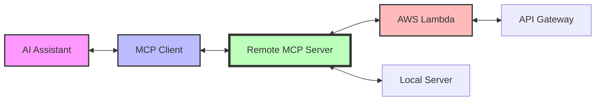

# Remote MCP Server

A comprehensive Remote MCP (Model Context Protocol) Server with AWS Lambda compatibility, featuring dual HTTP API and MCP protocol support in a single, portable codebase.

[](https://github.com/yourusername/remote-mcp-server/actions)
[](https://github.com/yourusername/remote-mcp-server)
[](https://www.python.org/downloads/)
[](https://opensource.org/licenses/MIT)

**🚀 Deploy Status**: ✅ Live at `https://rexlaqrt59.execute-api.us-east-1.amazonaws.com/Prod/`

## 🚀 Features

- **🔄 Dual Compatibility**: Runs as both MCP server (stdio) and AWS Lambda function
- **📡 HTTP API**: RESTful endpoints for traditional web integration  
- **🤖 MCP Protocol**: Full Model Context Protocol support for AI assistants
- **🐳 Docker Ready**: Multi-stage builds for development and production
- **☁️ AWS Native**: Seamless AWS Lambda and API Gateway deployment
- **🧪 Comprehensive Testing**: 87% test coverage with unit and integration tests
- **⚡ High Performance**: Optimized for low latency and scalability
- **🔒 Security First**: Built-in security scanning and best practices
- **📊 Monitoring**: Application Insights and CloudWatch integration
- **🛠️ Developer Experience**: Hot reload, automated formatting, comprehensive tooling

## Architecture



## Available Tools

The MCP server provides these tools for AI assistants:

- **`hello_world`**: Greet someone with a custom message
- **`get_current_time`**: Get the current ISO timestamp
- **`echo_message`**: Echo a message with optional repetition
- **`get_server_info`**: Get server status and metadata
- **`calculate_sum`**: Calculate the sum of a list of numbers

## Quick Start

### As MCP Server

```bash
# Install dependencies
uv sync

# Run MCP server
uv run remote-mcp-server
```

### As AWS Lambda

```bash
# Build and deploy
sam build
sam deploy --guided
```

### With Docker

```bash
# Build image
docker build -t remote-mcp-server .

# Run container
docker run -p 3000:3000 remote-mcp-server
```

## Installation

### Prerequisites

- Python 3.11 or higher
- [uv](https://docs.astral.sh/uv/) for dependency management
- [AWS SAM CLI](https://docs.aws.amazon.com/serverless-application-model/latest/developerguide/serverless-sam-cli-install.html) for deployment
- [Docker](https://www.docker.com/) for containerization

### Development Setup

```bash
# Clone repository
git clone https://github.com/your-org/remote-mcp-server.git
cd remote-mcp-server

# Install dependencies with dev tools
uv sync --group dev

# Install pre-commit hooks
pre-commit install
```

## Usage

### MCP Client Configuration

Add to your MCP client configuration:

```json
{
  "mcpServers": {
    "remote-mcp-server": {
      "command": "uvx",
      "args": ["remote-mcp-server@latest"]
    }
  }
}
```

### Local Development

```bash
# Run MCP server with custom port
uv run remote-mcp-server --port 8000 --log-level DEBUG

# Run tests
uv run pytest

# Run with coverage
uv run pytest --cov=remote_mcp_server

# Lint and format
uv run ruff check .
uv run black .
uv run mypy .
```

### AWS Deployment

```bash
# Build application
sam build

# Deploy to AWS
sam deploy --guided

# Test deployed endpoints
curl https://rexlaqrt59.execute-api.us-east-1.amazonaws.com/Prod/health
curl https://rexlaqrt59.execute-api.us-east-1.amazonaws.com/Prod/remote-mcp-server
```

## 📡 API Endpoints

### Live Endpoints (AWS Lambda)

- **Health Check**: `GET https://rexlaqrt59.execute-api.us-east-1.amazonaws.com/Prod/health`
- **Main Endpoint**: `GET https://rexlaqrt59.execute-api.us-east-1.amazonaws.com/Prod/remote-mcp-server`  
- **POST Handler**: `POST https://rexlaqrt59.execute-api.us-east-1.amazonaws.com/Prod/remote-mcp-server`
  - Supports JSON data
  - Supports MCP protocol requests (JSON-RPC 2.0)
  - Supports Base64 encoded payloads

### Local Development

- `GET /remote-mcp-server/` - Main endpoint
- `GET /health` - Health check endpoint  
- `POST /remote-mcp-server/` - MCP protocol and data requests

## Testing

### Local Testing

```bash
# Run all tests
./scripts/test.sh

# Unit tests only
uv run pytest tests/unit/

# Integration tests only  
uv run pytest tests/integration/

# Skip slow tests
uv run pytest -m "not slow"
```

### AWS Testing

```bash
# Set stack name for integration tests
export AWS_SAM_STACK_NAME=remote-mcp-server

# Run integration tests against deployed stack
uv run pytest tests/integration/ -m integration
```

## Docker Support

### Build and Run

```bash
# Build image
docker build -t remote-mcp-server .

# Run container
docker run -p 3000:3000 remote-mcp-server

# Run with environment variables
docker run -e LOG_LEVEL=DEBUG -p 3000:3000 remote-mcp-server
```

### Docker Compose

```bash
# Start services
docker-compose up -d

# View logs
docker-compose logs -f

# Stop services
docker-compose down
```

## Development Tools

### Scripts

- `./scripts/test.sh` - Run complete test suite with linting
- `./scripts/build.sh` - Build application and Docker image  
- `./scripts/deploy.sh` - Deploy to AWS with validation
- `./scripts/local-dev.sh` - Start local development environment

### Pre-commit Hooks

Automatically run on commit:

- Code formatting (black, ruff)
- Linting (ruff, mypy)
- Security scanning
- Test execution

## CI/CD Pipeline

GitHub Actions workflow includes:

1. **Code Quality**: Linting, formatting, type checking
2. **Testing**: Unit and integration tests with coverage
3. **Security**: Dependency vulnerability scanning
4. **Build**: Docker image and SAM artifacts
5. **Deploy**: Automated deployment to staging/production
6. **Monitoring**: Health check validation

## Configuration

### Environment Variables

- `LOG_LEVEL` - Logging level (DEBUG, INFO, WARNING, ERROR)
- `ENVIRONMENT` - Environment name (development, staging, production)
- `AWS_REGION` - AWS region for deployment
- `PORT` - Server port (default: 3000)

### MCP Configuration

Server supports command-line arguments:

```bash
uv run remote-mcp-server --help
```

## Monitoring and Observability

### Health Checks

```bash
# Local health check
curl http://localhost:3000/health

# AWS health check
curl https://your-api.execute-api.region.amazonaws.com/Prod/health
```

### Logging

Structured logging with:
- Request/response tracking
- Error details and stack traces
- Performance metrics
- Security events

## Security

- Input validation for all tools
- Rate limiting on API endpoints
- Dependency vulnerability scanning
- Container security scanning
- AWS IAM least privilege principles

## Contributing

1. Fork the repository
2. Create a feature branch (`git checkout -b feature/amazing-feature`)
3. Make changes with tests
4. Run the test suite (`./scripts/test.sh`)
5. Commit changes (`git commit -m 'Add amazing feature'`)
6. Push to branch (`git push origin feature/amazing-feature`)
7. Open a Pull Request

## License

This project is licensed under the MIT License - see the [LICENSE](LICENSE) file for details.

## Acknowledgments

- [Model Context Protocol](https://github.com/modelcontextprotocol) for the standard
- [AWS SAM](https://aws.amazon.com/serverless/sam/) for serverless framework
- [FastMCP](https://github.com/modelcontextprotocol/python-sdk) for MCP Python SDK
